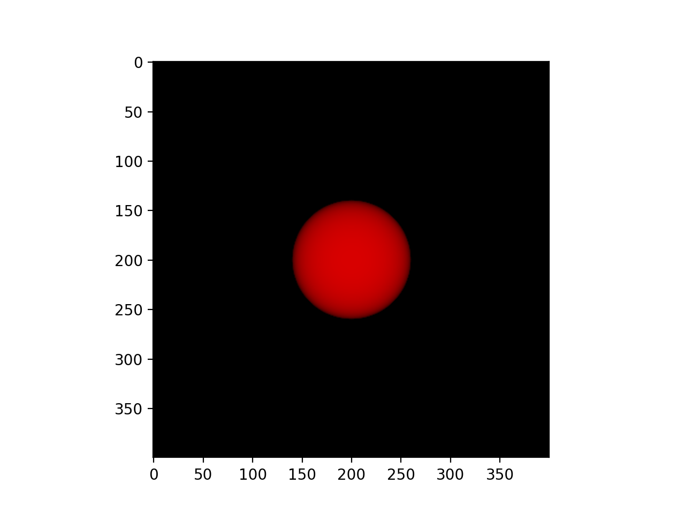
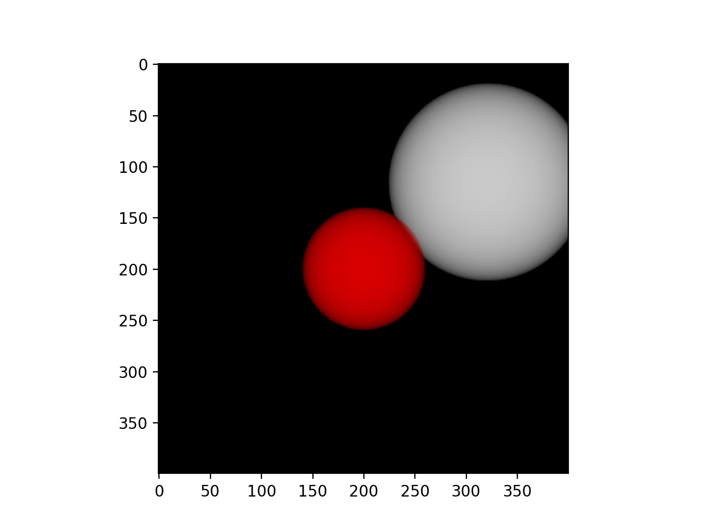

# Volummetric-rendering
</img> </img>

## Methodology
We render the color of any ray passing through the scene using principles from classical volume rendering. The volume density σ(x) can be interpreted as the differential probability of a ray terminating at an infinitesimal particle at location x. We numerically estimate this continuous integral using quadrature. Deterministic quadrature, which is typically used for rendering discretized voxel grids, would effectively limit our representation’s resolution because the MLP would only be queried at a fixed discrete set of locations. Instead, we use a stratified sampling approach where we partition [tn, tf ] into N evenly-spaced bins and then draw one sample uniformly at random from within each bin

## Metal support for ARM chips on MacOS ('mps')

Change device='mps' from device='cpu' to run this on your GPU. The tensors are especially transformed into float32 dtype from float64 to enable functioning on Metal GPUs

## How to run
You can check the <a href='existing.py'>existing.py</a> for existing models and can even add yours and experiment. </a>
```
pip install torch matplotlib numpy
python main.py
```


## Citation 
Classical volume rendering -> Kajiya, J.T., Herzen, B.P.V.: Ray tracing volume densities. Computer Graphics (SIGGRAPH) (1984)
```
@article{article,
author = {Kajiya, James and von herzen, Brian},
year = {1984},
month = {07},
pages = {165-174},
title = {Ray Tracing Volume Densities},
volume = {18},
isbn = {0-89791-138-5},
journal = {ACM SIGGRAPH Computer Graphics},
doi = {10.1145/964965.808594}
}
```

This is made in an attempt to create the original NeRF model from scratch :

```
@misc{mildenhall2020nerf,
      title={NeRF: Representing Scenes as Neural Radiance Fields for View Synthesis}, 
      author={Ben Mildenhall and Pratul P. Srinivasan and Matthew Tancik and Jonathan T. Barron and Ravi Ramamoorthi and Ren Ng},
      year={2020},
      eprint={2003.08934},
      archivePrefix={arXiv},
      primaryClass={cs.CV}
}
```